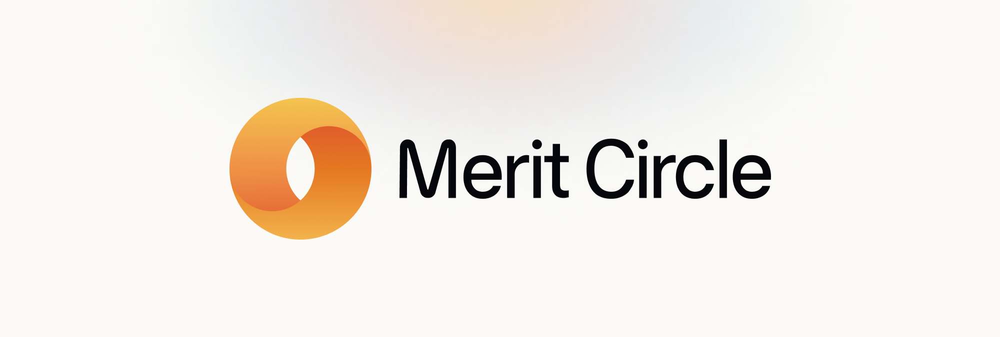

# Introducing Merit Circle

Merit Circle is creating a decentralized autonomous organization that develops opportunities to earn through play for people who want to help build the metaverse. This is done through the Merit Circle platform we are building, which hosts scholarship opportunities, educational opportunities and everything a person could need on their journey towards being an earning gamer in the metaverse.&#x20;

The Merit Circle DAO consists of a mainDAO governing over numerous subDAOs that function as tentacles all across the Play-to-Earn industry. The protocol is maintained by various independent parties and individuals through governance powered by the MC token holders.&#x20;

## Merit Circle for the people

> The Merit Circle DAO is meant as an instrument that suits the needs of many different groups. Operating in a novel industry like the Play-to-Earn industry, we're bridging the gap between gamers, DAO contributors and education.

> ### Gamers
>
> The Merit Circle DAO will consist of a platform for players to earn revenue by playing games in the Play-to-Earn model. Earning revenue is something every player can do on their own but there are many benefits to collaborate with Merit Circle.
>
> * We offer the most competitive in-game assets to our players
> * We offer educational content and host classes to improve the performance of our players
> * We have a vibrant community of fellow gamers
> * We will be hosting meta-games on top of the existing games for our community members
> * We will be granting additional rewards to our best performing players
>
> We're currently home to more than 1,500 scholars with assets purchased to onboard thousands of new scholars in the upcoming months.&#x20;

### Managers

In the blockchain gaming space there are thousands of gamers spread out across the globe. To structure these flows and handle requests, there are managers overseeing the daily operations. Similar to the above, the Play-to-Earn model allows every single person to host their own students and become a manager themselves, but being a Merit Circle manager comes with additional benefits:

* We have a vibrant pool of some of the best players in multiple games
* We allow managers to switch between various games seamlessly&#x20;
* We reward our managers with additional rewards based on their performance
* We have a wide range of tools and scripts to optimally structure workflows

We are proud of the current set of managers that we have spread out across Asia and Africa. We're determined to have managers across the entire globe helping their local communities to start playing and earning.&#x20;

### Dao Contributors

Merit Circle functions as an index fund for the Play-to-Earn industry. Our current balance sheet consists of numerous highly valuable assets spread out across multiple games. Each strategy we embrace, whether that's a scholarship model, land plays or a financial investment, we aim to make profit to enlarge our DAO's treasury.

We allow everyone to become a Merit Circle DAO contributor by purchasing the MC token and thereby receiving your stake of the DAO. Each contributor will directly and in-directly benefit from the growing value of our DAO's treasury that will result in a growing floor price for the MC token.

Anyone that contributes to our DAO can plant their flags in the Metaverse and share in the growth of the entire industry in a passive way. Merit Circle does the job, you do the earning.&#x20;

Follow our handy guides to get started on the basics as quickly as possible:
