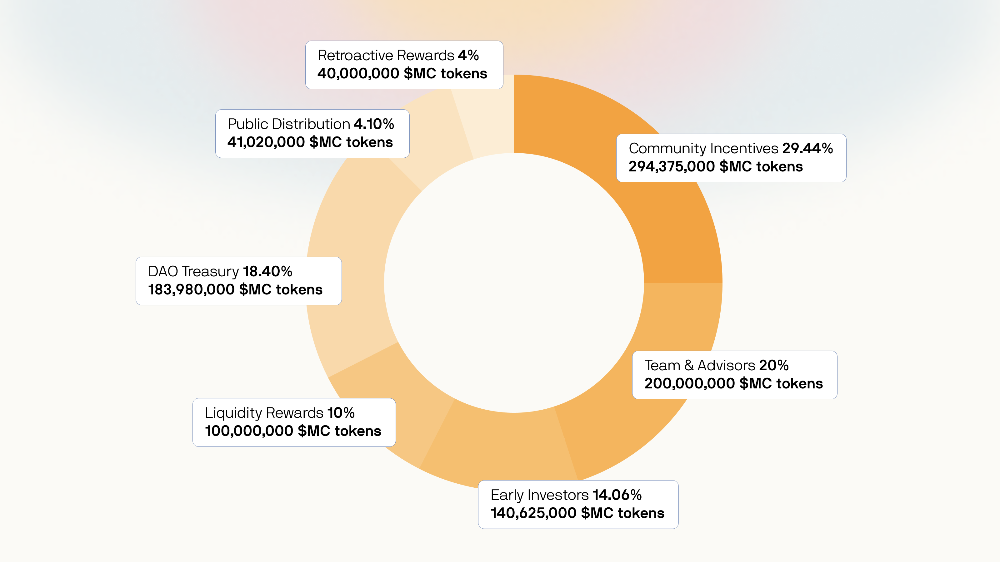

# Token distribution

The total supply will be 1,000,000,000 $MC tokens to be minted with no possibility for future inflation. The tokens will be distributed in the Token Generation Event (TGE) to the following stakeholders within the DAO:

* **Community Incentives** - through various means we want to reward our community for their efforts in contributing to our DAO's succes - 29.44% (294,375,000 MC tokens) -> [<mark style="color:orange;">Wallet</mark>](https://etherscan.io/address/0x56475a4a8D00b6F7b01E0879CBbba609707aef6b)<mark style="color:orange;"></mark>
* **Team & Advisors** - rewarding the core team members and advisors for their full-time effort to our DAO's succes 20% (200,000,000 MC tokens) -> [<mark style="color:orange;">Wallet</mark>](https://etherscan.io/address/0x97173277FED329ee844BAfa44D7719ad372a7150)<mark style="color:orange;"></mark>
* **DAO Treasury** - a position in the entire DAO's treasury will consist of MC tokens -  18.40% (183,980,000 MC tokens) -> [<mark style="color:orange;">Wallet</mark>](https://etherscan.io/address/0x7e9e4c0876b2102f33a1d82117cc73b7fddd0032#tokentxns)<mark style="color:orange;"></mark>
* **Early Investors** - the contributors that participated in our seed round - 14.06% (140,625,000 MC tokens) -> [<mark style="color:orange;">Wallet</mark>](https://etherscan.io/address/0xB5A0cbB4fC7294642216Cd7AFbc3525B24316cbc)<mark style="color:orange;"></mark>
* **Liquidity Rewards** - incentives for providing liquidity on decentralized exchanges - 10% (100,000,000 MC tokens)&#x20;
* **Public distribution** - tokens set aside for the public round - 4.10% (41,020,000 MC tokens)&#x20;
* **Retroactive rewards** - reward for the earliest backers in the Axie420 period - 4% (40,000,000 MC tokens) -> <mark style="color:orange;"></mark> [<mark style="color:orange;">Wallet</mark>](https://etherscan.io/address/0x4f6d9907fBc54feDeA9296860d36E14ccC348F7A)<mark style="color:orange;"></mark>

